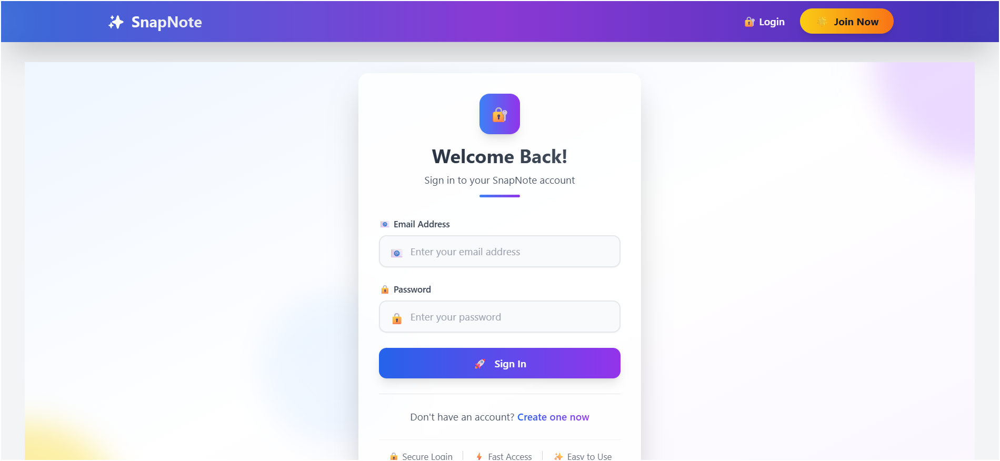
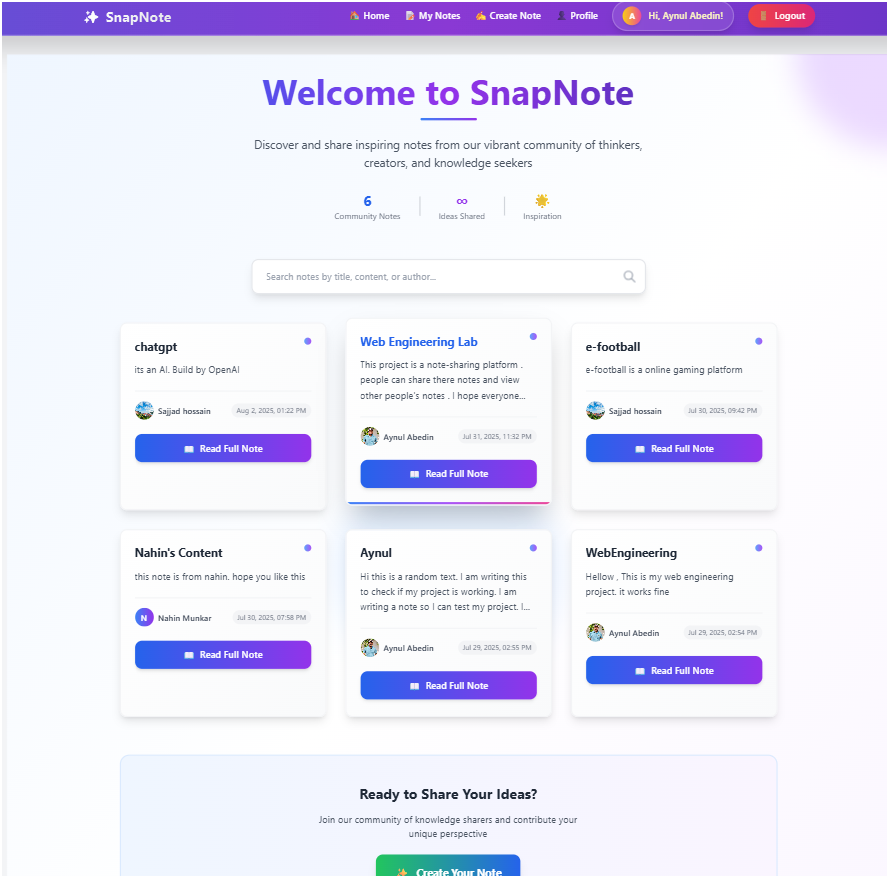
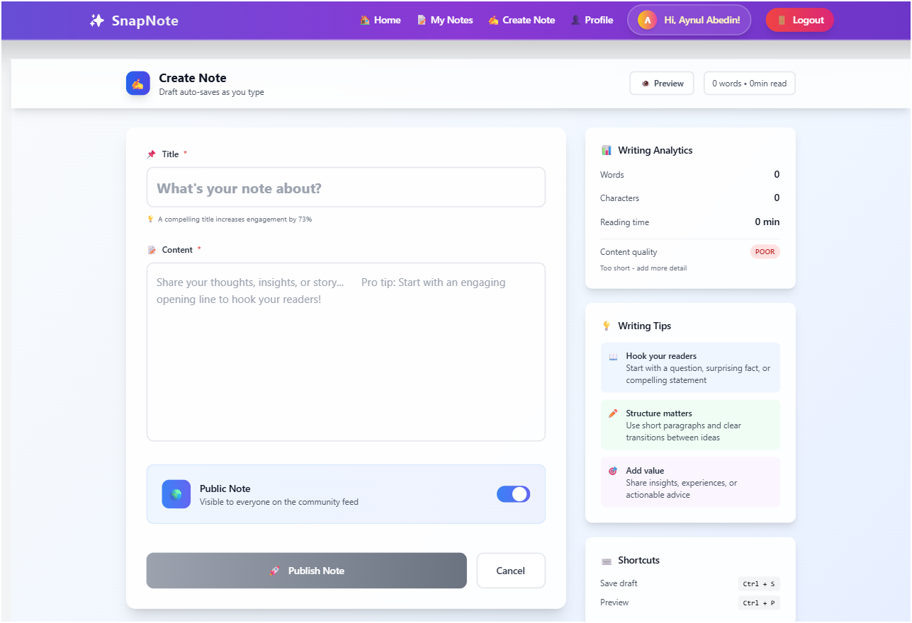
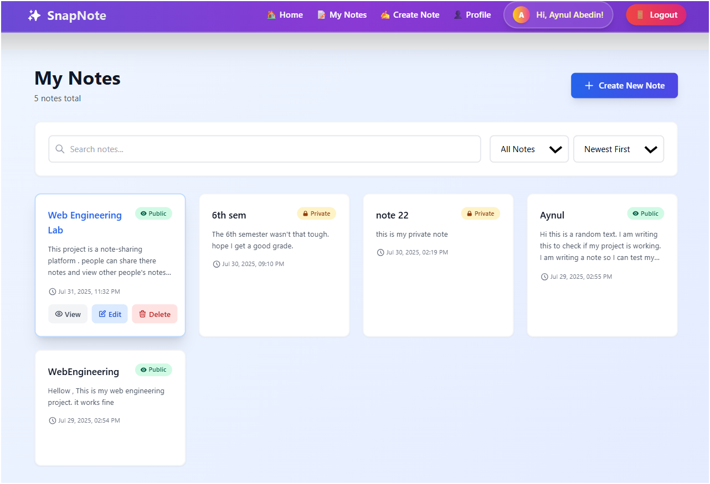
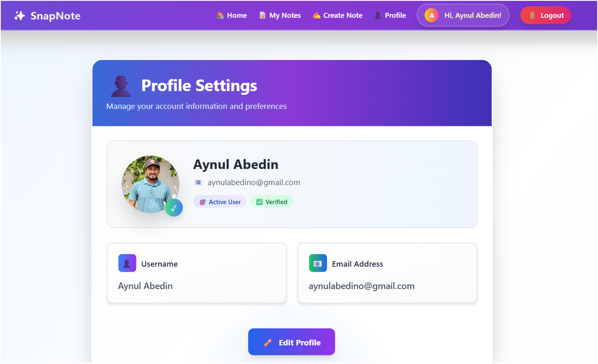

# SnapNote - Project Report
Project Summary

### Brief Overview
SnapNote is a modern web-based note-taking application that enables users to create, manage, and organize their digital notes efficiently. Built with Next.js and Node.js, it provides a seamless experience for users to capture and access their thoughts and information from any device.

### Problem Statement and Objectives

**Problem Statement:**
In today's digital world, users need a reliable and secure platform to:
- Store and organize their notes digitally
- Access their notes from any device
- Maintain privacy and security of their personal information
- Have a user-friendly interface for quick note-taking

**Objectives:**
1. Create a responsive and intuitive note-taking application
2. Implement secure user authentication and data protection
3. Provide seamless note management functionality
4. Deliver a modern and user-friendly interface

### Target Audience and Use Cases

**Target Audience:**
1. Students
   - Need to organize study materials
   - Want quick access to notes
   - Require easy note organization

2. Professionals
   - Need to maintain work-related notes
   - Require secure data storage
   - Want efficient note categorization

3. Personal Users
   - Need a digital solution for personal notes
   - Want easy note creation and editing
   - Require simple organization system

**Key Use Cases:**
1. Note Management
   - Creating new notes
   - Editing existing notes
   - Organizing notes by categories
   - Searching through notes

2. User Account Management
   - User registration
   - Secure login
   - Profile management
   - Password recovery

### Key Features and Functionalities

1. User Authentication
   - Secure registration and login
   - JWT-based authentication
   - Password encryption
   - User profile management

2. Note Management
   - Create and edit notes
   - View note details
   - Delete notes
   - List all user notes

3. User Interface
   - Responsive design
   - Intuitive navigation
   - Modern UI components

## 2.3.2 Technology Stack

### Frontend Technologies
1. Next.js Framework
   - React-based framework
   - Server-side rendering
   - Client-side navigation
   - Built-in routing

2. Styling and UI
   - Tailwind CSS for styling
   - Responsive design
   - Custom components
   - Modern UI/UX

3. State Management
   - React Context API
   - Local state management
   - Props drilling prevention

### Backend Technologies
1. Core Technologies
   - Node.js runtime
   - Express.js framework
   - MongoDB database
   - RESTful API architecture

2. Authentication & Security
   - JSON Web Tokens (JWT)
   - Bcrypt password hashing
   - Environment variables
   - CORS protection

### Development Tools
1. Development Environment
   - Visual Studio Code
   - Git version control
   - npm package manager
   - Chrome DevTools

2. Testing and Debugging
   - Browser developer tools
   - Postman for API testing
   - MongoDB Compass

### Third-party Services
1. Database
   - MongoDB Atlas cloud database

2. Version Control
   - GitHub repository hosting

### Deployment
1. Frontend Hosting
   - Vercel platform
   - Automatic deployments
   - SSL certification

2. Backend Hosting
   - Render/Heroku
   - Environment configuration
   - Security measures

## 2.3.3 Application Usage Guide

### Accessing the Application
- Production URL: [ deployed URL will be added]
- Supported Browsers: Chrome, Firefox, Safari, Edge

### User Registration/Login Process

1. Registration Steps:
   - Navigate to '/register'
   - Enter username, email, and password
   - Click "Register" button
   - Verify email (if implemented)

2. Login Steps:
   - Go to '/login'
   - Enter email and password
   - Click "Login" button
   - Access dashboard

### Main Features Guide

1. Creating a Note:
   - Click "New Note" button
   - Enter note title
   - Add note content
   - Click "Save"

2. Viewing Notes:
   - Access "My Notes" page
   - View list of all notes
   - Click on note to view details

3. Editing Notes:
   - Open note details
   - Click "Edit" button
   - Modify content
   - Save changes

4. Profile Management:
   - Click profile icon
   - View/edit profile information
   - Update password if needed

### Sample User Credentials
For testing purposes:
```
Email: demo@snapnote.com
Password: Demo@123
```

### Key Interface Screenshots
[Place screenshots here]

1. Login/Register Interface


2. Dashboard


3. Note Creation


4. Note Management


5. Profile Page


.
